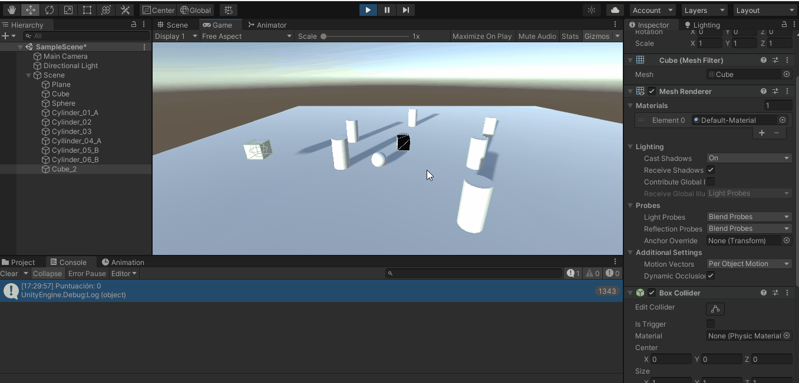

# Práctica 2

### Crear una escena simple sobre la que probar diferentes configuraciones de objetos físicos en Unity. La escena debe tener un plano a modo de suelo, una esfera y un cubo.

* **Ninguno de los objetos será físico.**

   
  

* **La esfera tiene físicas, el cubo no.**

   
  

* **La esfera y el cubo tienen físicas.**

   
  

* **La esfera y el cubo son físicos y la esfera tiene 10 veces la masa del cubo.**

   
  

* **La esfera tiene físicas y el cubo es de tipo IsTrigger.**

   
  

* **La esfera tiene físicas, el cubo es de tipo IsTrigger y tiene físicas.**

   
  

* **La esfera y el cubo son físicos y la esfera tiene 10 veces la masa del cubo, se impide la rotación del cubo sobre el plano XZ.**

   
  

---

### Sobre la escena que has trabajado ubica un cubo que represente un personaje que vas a mover. Se debe implementar un script que haga de CharacterController. Cuando el jugador pulse las teclas de flecha (o aswd) el jugador se moverá en la dirección que estos ejes indican.

* **Crear un script para el personaje que lo desplace por la pantalla, sin aplicar simulación física.**

   
  

* **Agregar un campo público que permita graduar la velocidad de movimiento desde el inspector de objetos.**

   
  

* **Estar a la escucha de si el usuario ha utilizado los ejes virtuales. Elegir cuales se va a permitir utilizar: flechas awsd.**

   
  

---

### Sobre la escena que has trabajado programa los sripts necesarios para las siguientes acciones: 

* **Se deben incluir varios cilindros sobre la escena. Cada vez que el objeto jugador colisione con alguno de ellos, deben aumenar su tamaño y el jugador aumentar puntuación**

   
  

* **Aggregar cilindros tipo A, en los que además, si el jugador pulsa la barra espaciadora lo mueve hacia fuera de él.**

   
  

* **Se deben incluir cilindros que se alejen del jugador cuando esté próximo.**

   
  

* **Ubicar un tercer objeto que sea capaz de detectar colisiones y que se mueva con las teclas I, L, J, M.**

   
  

* **Debes ubicar cubos que aumentan de tamaño cuando se le acerca una esfera y que disminuye cuando se le acerca el jugador.**

   
  

