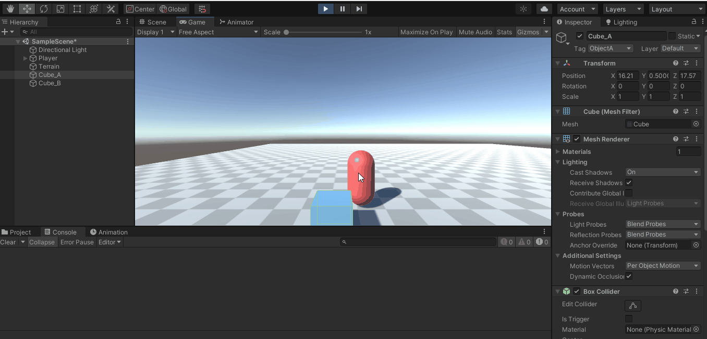

# Práctica 3

### Cuando el jugador colisiona con un objeto de tipo B, el objeto A mostrará un texto en una UI de Unity. Cuando toca el objeto A se incrementará la fuerza del objeto B

   
  
   
   

---

### Cuando el jugador se aproxima a los cilindros de tipo A, los cilindros de tipo B cambian su color y las esferas se orientan hacia un objetivo ubicado en la escena con ese propósito. Consultar información de la clase Vector3: LookAt, RotateTowards, ...

   
  
   
   

---

### Implementar un controlador que mueva el objeto con wasd

Para este apartado modifiqué el controlador creado en la práctica anterior en la que se movía el objeto con I, J, M, L para que pasae a moverse con W, A, S, D.

--- 

### Buscar información de Debug.DrawRay y utilízala para depuración.

   
  
   
   

